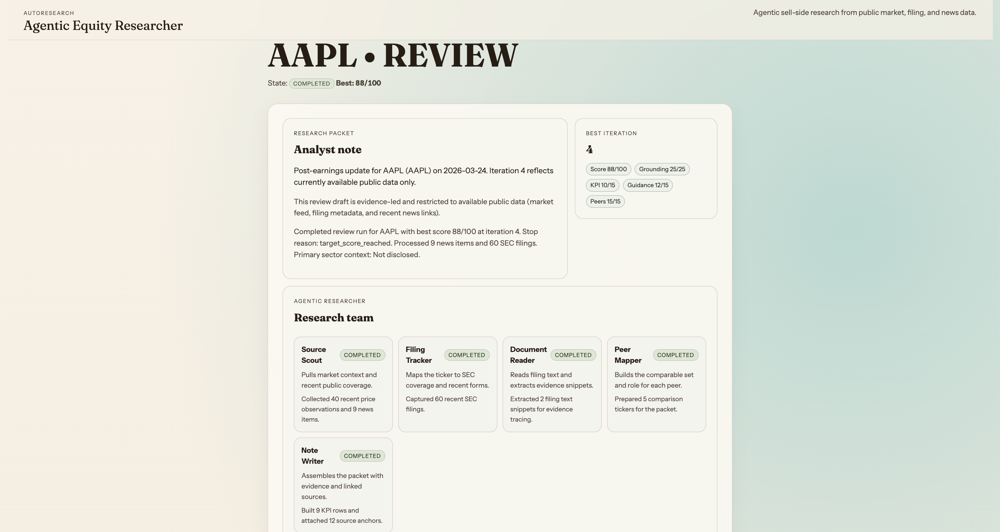

# AutoEarningsResearch

Agentic equity research prototype for one ticker at a time.



## Does it need API keys?

No. The current build runs without OpenAI keys or third-party finance API keys.

It uses:

- public Yahoo Finance access through `yfinance`
- public SEC endpoints
- a local FastAPI server running the research workflow

## What this app actually does

- Runs a multi-step research workflow for a single ticker in `preview` or `review` mode.
- Pulls public market context from Yahoo Finance via `yfinance`.
- Pulls SEC ticker mapping and recent filing metadata from the SEC submissions API.
- Fetches primary SEC filing documents for supported forms and extracts filing-text snippets.
- For `8-K` filings, attempts to follow the linked `Exhibit 99` earnings-release document and use that text as evidence.
- Builds a research packet with:
  - analyst note
  - KPI snapshot
  - valuation view
  - peer set
  - source links
  - evidence ledger
  - agent trace
- Scores each iteration against a fixed rubric and stops on target score, stagnation, or max iterations.

## What the UI shows

Homepage:

- a short explanation of what the app is for
- visible research agents
- run form
- recent runs

Run page:

- research packet first
- research team
- evidence ledger with snippet-level filing evidence when available
- agent trace
- iteration history as secondary diagnostics

## Current research agents

- `Source Scout`: market history and linked news
- `Filing Tracker`: SEC mapping and recent forms
- `Document Reader`: filing-text and `Exhibit 99` snippet extraction
- `Peer Mapper`: comparable set construction
- `Note Writer`: final packet assembly

## Public data sources in use

- Yahoo Finance `fast_info`
- Yahoo Finance price history
- Yahoo Finance linked news feed
- SEC `company_tickers.json`
- SEC submissions JSON feed
- SEC primary filing documents from EDGAR archives

## Honest limitations

- This is not a Bloomberg-quality research stack.
- It does not yet ingest full earnings call transcripts.
- It does not yet do claim extraction from transcript text.
- Valuation is still lightweight and should be read as directional context, not a full model.
- Filing snippet quality depends on what recent SEC documents are available for the ticker.
- Some tickers will still surface weak evidence if their recent filings are mostly insider forms or administrative filings.

## Good tickers for the current build

Large US names work best because they usually have:

- active SEC coverage
- stable Yahoo price history
- recent linked news
- recognizable peer sets

Examples:

- `MSFT`
- `AAPL`
- `TSLA`
- `JPM`
- `XOM`

## Stop rules

- `max_iterations = 5`
- `target_score = 85`
- `min_improvement = 2`
- `patience = 2`

## Quick start

```bash
python3 -m venv .venv
source .venv/bin/activate
pip install -r requirements.txt
uvicorn app.main:app --reload
```

Open [http://127.0.0.1:8000](http://127.0.0.1:8000)

## Tests

```bash
source .venv/bin/activate
pytest -q
```

## Configuration

Environment variables use the `AUTO_RESEARCH_` prefix.

Available settings in code right now:

- `AUTO_RESEARCH_USER_AGENT`
- `AUTO_RESEARCH_MAX_ITERATIONS`
- `AUTO_RESEARCH_TARGET_SCORE`
- `AUTO_RESEARCH_MIN_IMPROVEMENT`
- `AUTO_RESEARCH_PATIENCE`

## Notes

- SEC requests work better with a real contactable user-agent string.
- The README only documents behavior that is implemented in the current codebase.
